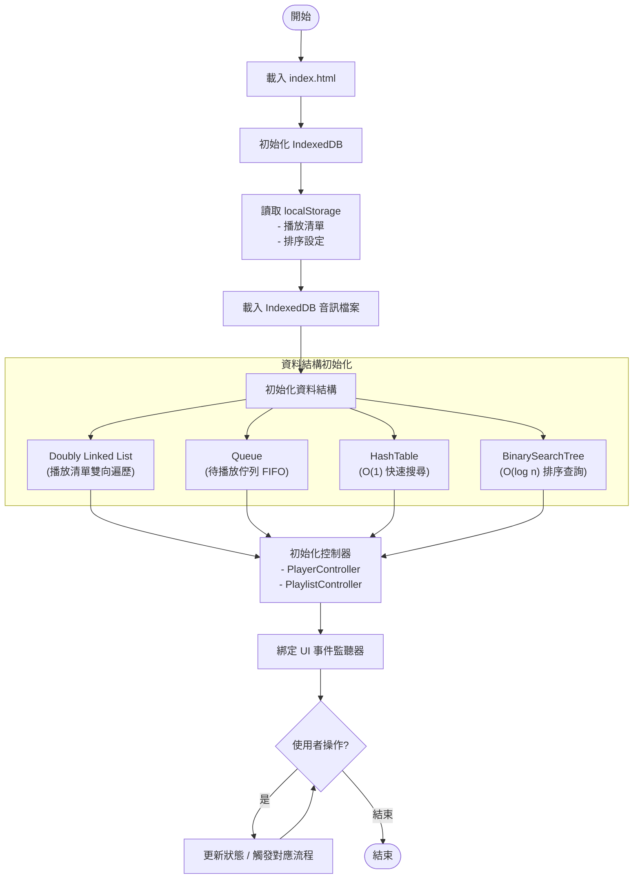
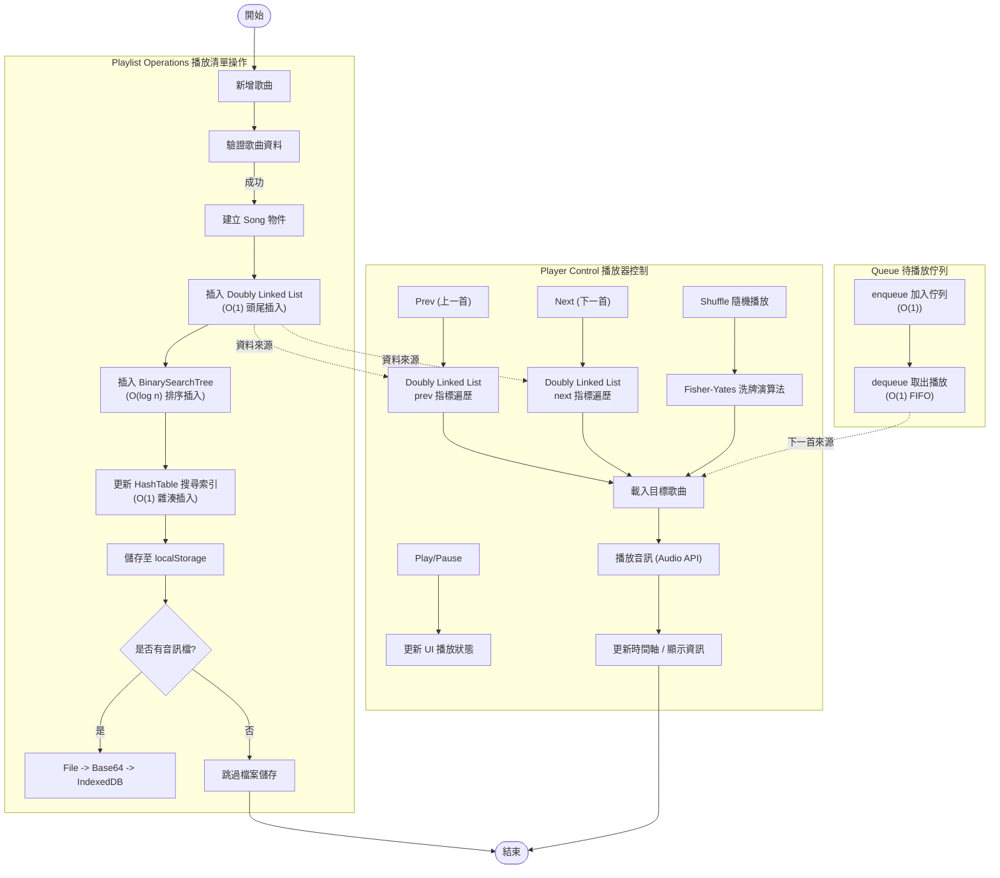
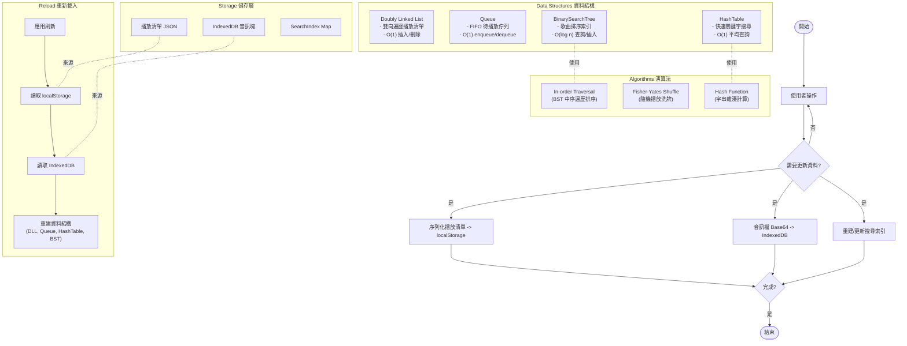

# 音樂播放清單管理器 — 標準流程圖（Mermaid）

以下提供三個統一風格的標準流程圖，使用 Mermaid 流程圖語法，分別涵蓋：
- 系統生命周期與初始化
- 播放控制與播放清單操作
- 資料持久化與搜尋索引

> 若 VS Code 或你的 Markdown Preview 未啟用 Mermaid，請安裝支援外掛或改用 GitHub/Obsidian 等支援 Mermaid 的預覽器。

---

## 系統生命周期與初始化



---

## 播放控制與播放清單操作



---

## 資料持久化與搜尋索引



---

### 備註
- 三張圖採用一致節點命名與方向配置，便於閱讀與維護。
- Mermaid 流程圖可在多數 Markdown 平台直接渲染；如需匯出圖片，可使用 Mermaid CLI 或擴充套件。

## 🎵 播放系統流程圖

```
                    ┌─────────────────────┐
                    │   播放列表管理      │
                    └──────────┬──────────┘
                               │
        ┌──────────────────────┼──────────────────────┐
        │                      │                      │
        ▼                      ▼                      ▼
   ┌─────────────┐      ┌──────────────┐      ┌──────────────┐
   │ 新增歌曲    │      │ 刪除歌曲     │      │ 搜尋歌曲     │
   │ (add)       │      │ (remove)     │      │ (search)     │
   └─────────────┘      └──────────────┘      └──────────────┘
        │                      │                      │
        ▼                      ▼                      ▼
   ┌─────────────┐      ┌──────────────┐      ┌──────────────┐
   │ 驗證歌曲    │      │ 驗證存在     │      │ 雜湊表查詢   │
   │ 物件        │      │              │      │ (O(1))       │
   └─────────────┘      └──────────────┘      └──────────────┘
        │                      │                      │
        ▼                      ▼                      ▼
   ┌─────────────────────────────────────────────────────┐
   │         更新播放列表 (LinkedList)                   │
   │    更新搜尋索引 & 儲存到 localStorage/IndexedDB    │
   └─────────────────────────────────────────────────────┘
```

---

## 🎚️ 播放控制流程圖

```
                    ┌──────────────────┐
                    │  播放器控制      │
                    └────────┬─────────┘
                             │
        ┌────────────────────┼────────────────────┐
        │                    │                    │
        ▼                    ▼                    ▼
   ┌─────────────┐      ┌──────────────┐    ┌──────────────┐
   │ 播放/暫停   │      │ 上一首/下一首│    │ 隨機播放     │
   │ (play/pause)│      │ (prev/next)  │    │ (shuffle)    │
   └──────┬──────┘      └───────┬──────┘    └───────┬──────┘
          │                     │                   │
          │        ┌────────────┴────────────┐      │
          │        │                        │      │
          ▼        ▼                        ▼      ▼
    ┌─────────────────────────────────────────────────┐
    │   更新當前播放索引 (currentIndex)               │
    │   獲取當前歌曲資訊                             │
    │   播放音訊檔案 (Audio API)                     │
    │   更新 UI 顯示歌曲資訊                         │
    └─────────────────────────────────────────────────┘
```

---

## 💾 資料存儲流程圖

```
                    ┌──────────────────────┐
                    │   資料持久化系統     │
                    └──────────┬───────────┘
                               │
        ┌──────────────────────┼──────────────────────┐
        │                      │                      │
        ▼                      ▼                      ▼
   ┌───────────────────┐  ┌──────────────┐  ┌──────────────────┐
   │  localStorage     │  │  IndexedDB   │  │ 搜尋索引         │
   │  (播放清單)       │  │  (音訊檔案)  │  │ (SearchIndex)    │
   └────────┬──────────┘  └──────┬───────┘  └────────┬─────────┘
            │                    │                   │
            ▼                    ▼                   ▼
     ┌─────────────────┐  ┌─────────────┐   ┌─────────────┐
     │ JSON 序列化     │  │ Base64      │   │ 更新文藝索引│
     │ 存儲/讀取       │  │ 編碼        │   │             │
     └─────────────────┘  └─────────────┘   └─────────────┘
            │                    │                   │
            └────────────────────┼───────────────────┘
                                 │
                    ┌────────────▼──────────┐
                    │  應用程式刷新時      │
                    │  自動載入資料        │
                    └───────────────────────┘
```

---

## 🔍 資料結構使用流程圖

```
                    ┌─────────────────────┐
                    │   播放清單資料結構  │
                    └──────────┬──────────┘
                               │
        ┌──────────────────────┼──────────────────────┐
        │                      │                      │
        ▼                      ▼                      ▼
   ┌────────────┐         ┌────────────┐       ┌─────────────┐
   │LinkedList  │         │HashTable   │       │BinarySearchTree
   │(主播放清單)│         │(搜尋索引)  │       │(排序/查詢)  │
   │ O(1) insert│         │ O(1)lookup │       │ O(logn)     │
   │ O(n) delete│         │ O(1) add   │       │             │
   │ O(n) search│         │            │       │             │
   └────────────┘         └────────────┘       └─────────────┘
        │
        │  (可選)
        ▼
   ┌────────────┐
   │Queue       │
   │(即將播放)  │
   │ O(1)enqueue│
   │ O(1)dequeue│
   └────────────┘
```

---

## 🔄 控制器互動流程圖

```
              ┌─────────────────────────────────┐
              │    UI 事件觸發 (點擊/輸入)      │
              └────────────┬────────────────────┘
                           │
        ┌──────────────────┴──────────────────┐
        │                                     │
        ▼                                     ▼
    ┌─────────────────┐                ┌──────────────┐
    │ PlayerController│                │PlaylistController
    │ (播放器邏輯)    │                │ (播放清單邏輯)
    └────────┬────────┘                └────────┬─────┘
             │                                  │
   ┌─────────┴──────────┬─────────────┬────────┴─────┐
   │                    │             │              │
   ▼                    ▼             ▼              ▼
Play/Pause        Previous/Next    Add Song    Remove Song
Update Status     Shuffle Mode     Validate    Update Index
Update Time       Update Display   Save to DB  Update UI
UI Display        Current Index              Search/Sort
```

---

## 🚀 應用程式生命周期流程圖

```
┌────────────────────────────────────────────────────────┐
│           使用者載入 index.html                        │
└────────────────┬─────────────────────────────────────┘
                 │
                 ▼
     ┌─────────────────────────────┐
     │ 1. 初始化 IndexedDB         │
     └────────────┬────────────────┘
                  │
                  ▼
     ┌─────────────────────────────┐
     │ 2. 從 localStorage 載入     │
     │    - 播放清單               │
     │    - 排序設定               │
     └────────────┬────────────────┘
                  │
                  ▼
     ┌─────────────────────────────┐
     │ 3. 從 IndexedDB 載入        │
     │    - 音訊檔案               │
     └────────────┬────────────────┘
                  │
                  ▼
     ┌─────────────────────────────┐
     │ 4. 重建搜尋索引             │
     │    (SearchIndexMap)         │
     └────────────┬────────────────┘
                  │
                  ▼
     ┌─────────────────────────────┐
     │ 5. 初始化控制器             │
     │    - PlayerController       │
     │    - PlaylistController     │
     └────────────┬────────────────┘
                  │
                  ▼
     ┌─────────────────────────────┐
     │ 6. 綁定 UI 事件監聽器       │
     └────────────┬────────────────┘
                  │
                  ▼
     ┌─────────────────────────────┐
     │ 7. 應用程式準備完成         │
     │    等待使用者操作           │
     └─────────────────────────────┘
```

---

## 📝 新增歌曲詳細流程

```
使用者填寫表單並提交
        │
        ▼
驗證歌曲資訊 (title, artist, duration)
        │
        ├─驗證失敗 ──→ 顯示錯誤訊息
        │
        ├─驗證成功
        │
        ▼
建立 Song 物件
        │
        ▼
產生歌曲唯一鍵 (songKey)
        │
        ▼
新增到 LinkedList (播放清單)
        │
        ▼
新增到 HashTable (搜尋索引)
        │
        ▼
若有上傳音訊檔案
        │
        ├─轉換為 Base64
        │
        ├─儲存到 IndexedDB
        │
        └─記錄索引
        │
        ▼
儲存到 localStorage
        │
        ▼
更新 UI 顯示
        │
        ▼
清空表單
```

---

## 🔎 搜尋歌曲流程

```
使用者輸入搜尋關鍵字
        │
        ▼
驗證搜尋字符 (不為空)
        │
        ├─為空 ──→ 顯示全部歌曲
        │
        ├─不為空
        │
        ▼
使用 HashTable 查詢 (O(1))
        │
        ├─查詢 by 曲名
        ├─查詢 by 歌手
        ├─查詢 by 組合
        │
        ▼
返回符合結果
        │
        ▼
更新搜尋結果顯示區域
        │
        ▼
允許使用者選擇並播放結果歌曲
```

---

## 📊 資料轉換流程

```
                    ┌──────────────────┐
                    │   檔案轉換系統   │
                    └────────┬─────────┘
                             │
        ┌────────────────────┼─────────────────────┐
        │                    │                     │
        ▼                    ▼                     ▼
   ┌─────────┐          ┌────────┐           ┌────────────┐
   │ 檔案輸入 │          │ 歌曲   │           │ JSON 資料  │
   │ (Music) │          │ 物件   │           │ (播放清單) │
   └────┬────┘          └───┬────┘           └─────┬──────┘
        │                   │                      │
        ▼                   ▼                      ▼
   ┌─────────────┐     ┌──────────┐          ┌──────────────┐
   │ FileReader  │     │ Song     │          │ JSON.stringify
   │ readAsArray │     │ (model)  │          │              │
   │ Buffer      │     │          │          │              │
   └─────┬───────┘     └──────────┘          └──────┬───────┘
         │                                          │
         ▼                                          ▼
    ┌────────────┐                             ┌─────────────┐
    │ Base64     │                             │ localStorage
    │ encode     │                             │ 字符串      │
    └─────┬──────┘                             └──────┬──────┘
          │                                           │
          ▼                                           ▼
    ┌────────────────┐                         ┌─────────────┐
    │ IndexedDB      │                         │ 重新加載時  │
    │ 儲存區塊       │                         │ JSON.parse  │
    └────────────────┘                         └─────────────┘
```

---

## 🎯 使用者互動決策樹

```
                    使用者打開應用
                          │
              ┌───────────┼───────────┐
              │           │           │
              ▼           ▼           ▼
          播放歌曲    管理播放清單   搜尋歌曲
              │           │           │
        ┌─────┴─────┐     │      ┌────┴─────┐
        │           │     │      │          │
        ▼           ▼     ▼      ▼          ▼
      播放     隨機播放  新增   刪除      by曲名  by歌手
        │           │    歌曲   歌曲        │       │
        ├─操作播放  │     │      │          │       │
        │ 按鈕      │     │      │      ┌───┴───┬───┴───┐
        └─更新進度  │     │      │      │       │       │
              │     │     │      │      ▼       ▼       ▼
              └─────┴─────┴─────┴─────按Enter 查詢  合併結果
                          │
                          ▼
                  更新 UI 並保存資料
```

---

## 💡 系統特性說明

### 📌 主要功能
- ✅ 播放清單管理 (新增/刪除/搜尋)
- ✅ 音樂播放控制 (播放/暫停/上一首/下一首)
- ✅ 隨機播放功能
- ✅ 進度條顯示
- ✅ 本地資料持久化
- ✅ 音訊檔案管理

### ⚙️ 技術棧
- **前端**: HTML5, CSS3, Vanilla JavaScript
- **儲存**: localStorage (播放清單) + IndexedDB (音訊檔案)
- **資料結構**: LinkedList, HashTable, Queue, BinarySearchTree
- **API**: Web Audio API, FileReader API

### 🎯 效能優化
- LinkedList: O(1) 插入操作
- HashTable: O(1) 搜尋操作  
- BinarySearchTree: O(log n) 排序查詢
- 快取系統: 最大歌手編號、搜尋索引

